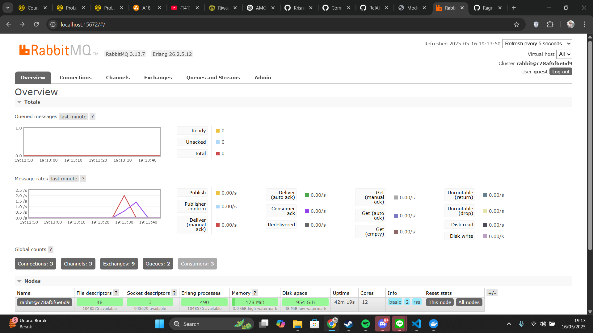

## AMQP Overview

**AMQP** stands for **Advanced Message Queuing Protocol**.  
It is an open standard protocol for message-oriented middleware. AMQP enables systems to communicate by sending messages through queues, supporting **reliable, asynchronous communication** between distributed applications.

AMQP is commonly used with message brokers like **RabbitMQ**.

---

## Understanding `guest:guest@localhost:5672`

- **guest** (first) – Username for authentication  
- **guest** (second) – Password for authentication  
- **localhost** – Hostname (refers to the local machine)  
- **5672** – Port number used by AMQP brokers (like RabbitMQ) for client connections

This means:
> Connect to an AMQP broker running on your local machine (`localhost`) at port `5672`, using the username `guest` and password `guest`.

## RabbitMQ

### Simulation slow subscriber

## Impact of Slowing Down the Subscriber

In the image above, the **Subscriber** was intentionally slowed down by introducing a **1-second delay** in processing each message.

### Key Observations:

- This delay reduced the Subscriber's ability to keep up with incoming messages.
- Since the **Publisher** continued sending messages at a faster rate, the **message broker** began **queuing** the incoming data.
- As a result, the number of **queued messages** in the broker increased over time.

In this specific case, after running the Publisher **twice**, the total number of queued messages in the message broker reached **6**.

This demonstrates how **imbalanced message rates** between Publisher and Subscriber can lead to **message buildup** in the broker.

## Running Three Subsribers

In the same experiment described in the **Simulation of a Slow Subscriber** section, I ran multiple Subscribers instead of just one.

### Key Findings:

- **Faster Data Transmission:**  
  Running multiple Subscribers accelerated data processing. The message broker distributed incoming messages from the Publisher across all connected Subscribers, preventing the accumulation of new messages in the queue.

- **Improved Queue Management:**  
  When three Subscribers were active, after running publisher twice, the number of queued messages dropped significantly—from an initial 6 to 0. This clearly illustrates that increasing the number of Subscribers can dramatically improve throughput and reduce the backlog within the message broker.

- **Dynamic Scalability:**  
  Without changing any code, different outcomes can be achieved by simply altering the message broker's configuration or adjusting the number of active Subscribers. This approach exemplifies the principles of **event-driven architecture**.

This experiment shows how scaling the number of consumers can be a powerful strategy to optimize message processing systems.